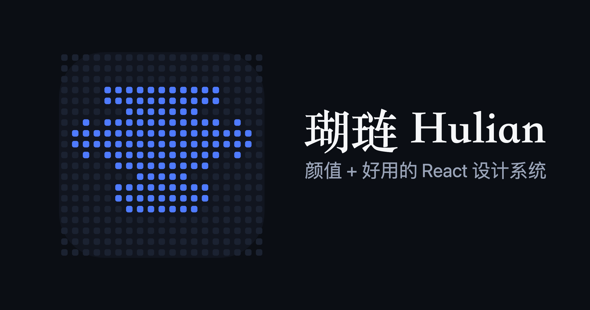

<p align="center">
  
</p>

<h1 align="center">Hulian (瑚琏)</h1>

<p align="center">
  A beautiful, practical React design system — <b>377 components</b>, OKLCH theming · Tailwind v4 · zero-flash dark mode · runtime theming.
</p>

<p align="center">
  <a href="https://www.npmjs.com/package/@hulianui/ui"></a>
  <a href="https://www.npmjs.com/package/@hulianui/ui"></a>
  <a href="LICENSE"></a>
  <a href="https://github.com/hulianui/hulian/actions/workflows/ci.yml"></a>
  <a href="https://github.com/hulianui/hulian/stargazers"></a>
</p>

<p align="center">
  <a href="https://hulianui.haloritual.com"><b>📖 Docs</b></a> ·
  <a href="https://hulianui.haloritual.com/demos"><b>🏗️ Live Demos</b></a> ·
  <a href="README.md"><b>中文</b></a>
</p>

---

**Hulian** is a React component library you can `import` directly, paired with a real-data, tweakable [showcase docs site](https://hulianui.haloritual.com). Accessible behavior comes from Base UI; skinning comes from a Tailwind v4 OKLCH two-layer token system — light/dark switching is flash-free and themes can be swapped at runtime.

## ✨ Features

- 🧩 **377 components** — controls / forms / data display / feedback / navigation / overlay / charts / effect backgrounds / AI agent / live streaming / node canvas …
- 🎨 **OKLCH two-layer tokens** — primitive + semantic layers; toggle `[data-theme]` with zero flash, re-theme at runtime
- ♿ **Accessibility first** — behavior layer built on [Base UI](https://base-ui.com); keyboard / focus / ARIA out of the box
- 🌗 **Zero-flash dark mode** — `ThemeProvider` + an entry inline script keep SSR first paint clean
- 📦 **Zero-token public install** — published to public npm; `pnpm add @hulianui/ui` just works
- 🔧 **Source distribution** — ships TSX source so your Tailwind fully owns the styling; no black-box CSS
- 📚 **AI-first docs** — every component has Props/Events/Slots + live examples + a playground, and emits `llms.txt`
- 🏗️ **19 real demos** — CRM / shop / data dashboard / AI workflow / live streaming … all dogfooding the library

## 📦 Quick start

**1. Install** (public npm, no registry config, no token)

```bash
pnpm add @hulianui/ui @hulianui/tokens
# peers: react · react-dom · tailwindcss · @base-ui/react · motion
```

**2. Import tokens + preset, and add the library source to Tailwind's scan** (global CSS)

```css
@import "@hulianui/tokens/tokens.css";
@import "@hulianui/tokens/preset.css";
@source "../node_modules/@hulianui/ui/src/**/*.{ts,tsx}";
```

**3. Wrap with `ThemeProvider` and use**

```tsx
import { ThemeProvider, Button } from "@hulianui/ui";

export default function App() {
  return (
    <ThemeProvider defaultSetting="system">
      <Button>Hulian</Button>
    </ThemeProvider>
  );
}
```

> Packages ship **source** (`src/`), not a compiled `dist`, so consumers must transpile TSX: **Next.js** → add `transpilePackages: ["@hulianui/ui"]`, and — when running **webpack dev** (Next 15 and below) — pair it with `experimental.optimizePackageImports: ["@hulianui/ui"]`, without which cold compiles are several times slower (measured no difference under Next 16's Turbopack; [why](docs/consuming.md#nextjs-消费方这是最糟的一档务必加一行配置)); **Vite** → usually no extra config. The anti-flash inline script is injected by each app's entry (see [`apps/www/app/theme-script.tsx`](apps/www/app/theme-script.tsx)).

## 🛠️ Tech foundation

- **Base UI** (`@base-ui/react`, headless behavior / a11y)
- **Tailwind v4** + two-layer OKLCH CSS-variable tokens (primitive + semantic)
- **class-variance-authority** for variants · **lucide-react** icons · **motion** animation
- monorepo: **pnpm + Turborepo** · docs site **Next.js 16 + React 19**

## 🤝 Contributing

Issues and PRs welcome. Local dev:

```bash
pnpm install
pnpm --filter www dev   # docs site at http://localhost:5512
pnpm test               # full suite (vitest, two projects: jsdom units + real chromium)
pnpm typecheck
```

See [CONTRIBUTING.md](CONTRIBUTING.md) · [Code of Conduct](CODE_OF_CONDUCT.md) · report security issues per [SECURITY.md](SECURITY.md) · release flow in [docs/publishing.md](docs/publishing.md).

## 📄 License

[MIT](LICENSE) © hulianui
